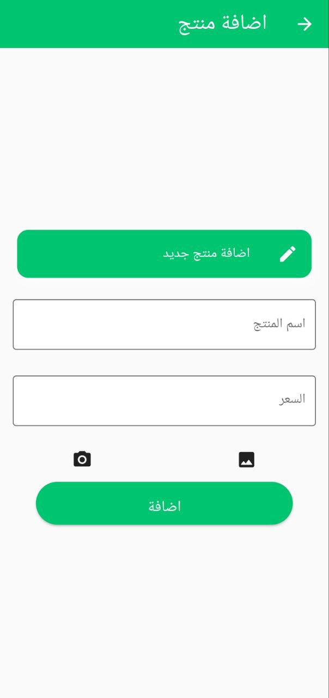
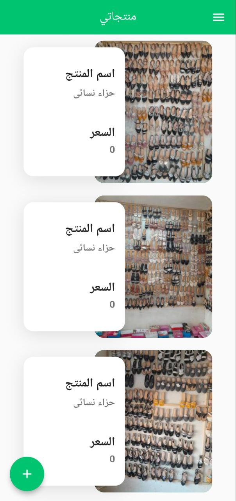
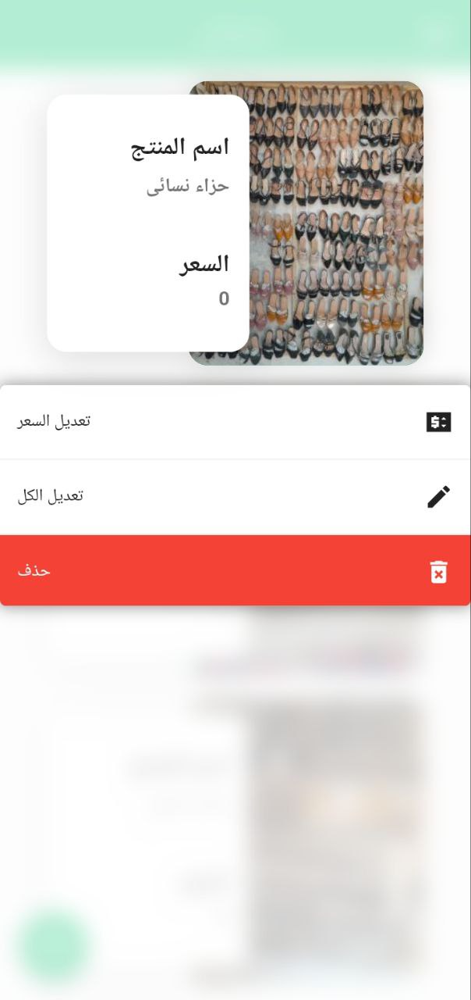
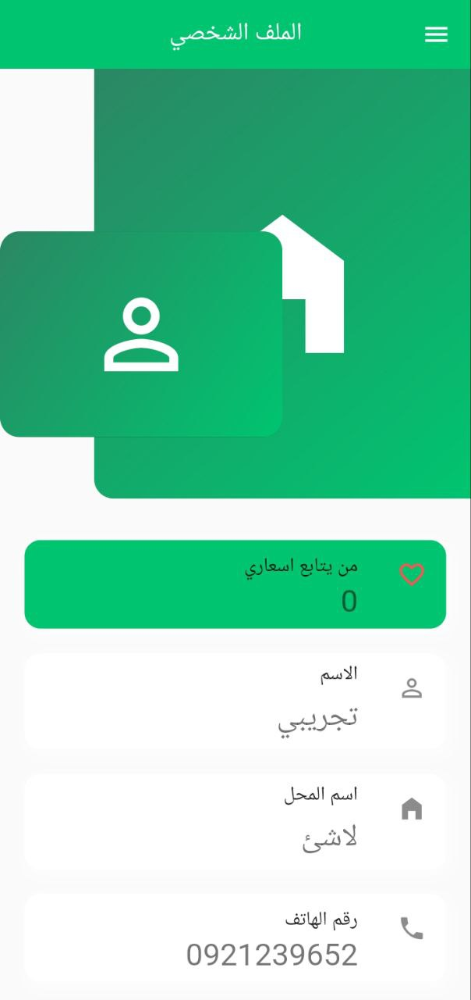
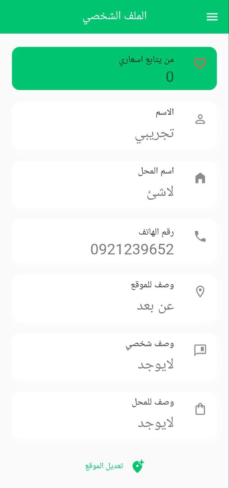
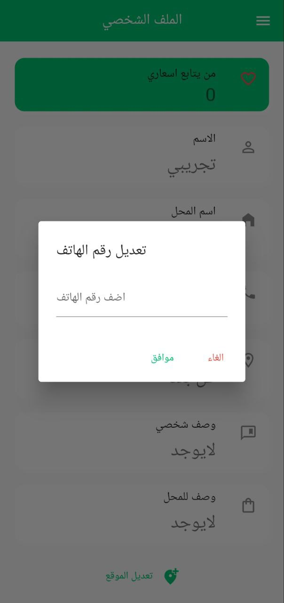

# grocery_shope_app
grocery App for Displaying its Products
The Grocery Store account is your gateway to managing your online store and reaching more customers. With our platform, you can easily upload and manage your product catalog, update your store information, and communicate with your customers. You can also view your sales history and track your orders in real time, giving you valuable insights into your business. Plus, our app uses location-based technology to connect you with nearby customers, helping you reach new audiences and grow your business. Whether you're an established retailer or just starting out, the Grocery Store account makes it easy to sell groceries online and reach more customers than ever before.
# images
| :------: | :------: | :------: |
|  |  |  |
| :------: | :------: | :------: |
|  |  |  |
| :------: | :------: | :------: |
|  |  |  |

